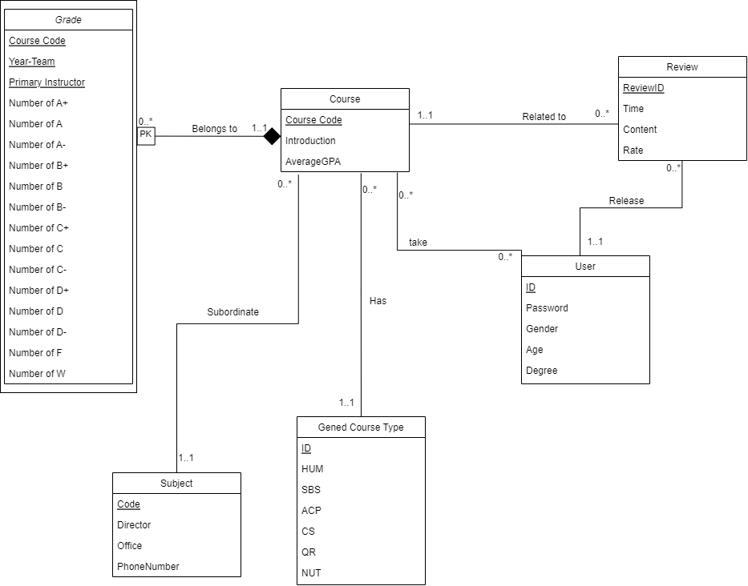

# Stage.2: Database Design

## UML Diagram



## Entities

We have a total of 6 entities in our database design. They are different aspects about the education system in UIUC. Their explanations are as follows.

### 1.User
It contains user information, with 5 attributes

- **UserId**: A unique identifier between users. It will be the **primary key** and will be of a string attribute. The user can use this as username to login
- **Password**: A string attribute which will be the password for user to log in.
- **Gender**: An enumerate attribute with values `Male`, `Female`, `Other`, and `Unknown`.
- **Age**: An integer to display user's age
- **Degree**: An attribute with values `Undergraduate` , `Master` and `PhD`.

Assumptions: Each user in the system is assigned a unique UserId upon registration, which serves as the primary key, ensuring consistent and secure identification across the system. The password attribute is used for user authentication during login. The gender, age, and degree information can be modified after registration, providing flexibility for users to update their profiles. The gender is set to 'Unknown' by default and the age is set to 0. This entity is designed to maintain essential user information, including authentication and personal details, to enable personalized and secure access to the system's features.


### 2.Course

It contains the general information about a specific course. There are 3 attributes.

- **Course Code**: A unique identifier between courses. It is in the form "subject + number" like "CS 225". It is unique for every course, so it is the **primary key**.
- **Introduction**: A brief introduction about the content of the course.
- **AverageGPA**: The average GPA of all terms and sections for a course.

Assumptions：The course entity is intended to encapsulate the key information about each course offered at the university. The Course Code, serving as a unique identifier and primary key, ensures that each course is distinctly identified by its unique combination of subject and number, like "CS 225". The system records only the most crucial details of a course - its code, a brief introduction, and the average GPA, which simplifies course management and allows students to quickly glean important information about courses. This entity aids in the streamlined presentation and management of course offerings within the university.


### 3.Grade Entries 

It contains the Grade distribution and instructor information each semester. There are totally 18 attributes

- **Course Code**: One of the **primary key**. The **foreign key** to `Course`
- **YearTerm**: One of the **primary key**. It is a string used to identify the semester in which this class was conducted.
- **Primary Instructor** :One of the **primary key**. A string attibute to display the instructor of this course in a specified semester.
- **A+,A,A-,B+,B,B-,C+,C,C-,D+,D,D-,F,W**: Some integers to display how many students got a specified grade level

  
Assumptions: The Grade Entries entity represents a detailed breakdown of grades distributed for a course in a specific term.Each grade entries is uniquely identified by the combination of `Course Code`, `Year term` and its `primary instructor`, like `sp2022 cs225 Herman, Geoffrey L` As a weak entity reliant on the Course entity, it can't be uniquely identified without specifying the course. This design allows for a comprehensive view of grade distributions and instructor details specific to each term and course. It facilitates the analysis and tracking of academic performance trends over different semesters and courses, providing valuable insights for both students and faculty.

### 4.Review

The Review entity encapsulates the feedback provided by users.

- **ReviewID**: This is the unique identifier for each review.It works as a **primary key**.
- **Time**: This attribute records the time when the review was submitted.
- **Content**: This is a textual attribute containing the user's comments about their experience. 
- **rate**: This is a int attribute from 1-5 to express users' satisfaction degree with the course

Assumption: Each review is unique and tied to a single user and course, reflecting personal experiences and opinions. Users have the flexibility to modify their reviews and ratings post-publication, allowing for dynamic feedback that can evolve with the user's perspective or experience. This entity enhances the course selection process for students by providing peer insights and also serves as a valuable tool for course improvement based on student feedback.

### 5.Subject

The subject of courses
- **Code**: The **primary key** of this entity, it is a string attribute like "CS" and "ECE".
- **Director**: A string attribute for subject director name.
- **Office**: A string attribute for the subject's office location
- **Phone**: A string attribute for the office 's phone number.

Assumption:Each subject represents a distinct academic discipline or area of study within the university. The "Code" attribute, serving as the primary key, ensures that each subject is uniquely identified by its abbreviated code, such as "CS" for Computer Science or "ECE" for Electrical and Computer Engineering. The director, office, and phone number are specific to each subject and provide essential administrative details.


### 6.Gened Course Type

It contains several Gened Course attribute combinations.

- **ID**：The unique indentifier which represents a attribute combination and it is also the **primary key** of this entity.
- **HUM**: An identifier for HUM. 0 means **not belong to** and 1 means **belong to**.
- **SBS**: An identifier for SBS. 0 means **not belong to** and 1 means **belong to**.
- **ACP**: An identifier for ACP. 0 means **not belong to** and 1 means **belong to**.
- **CS**: An identifier for CS. 0 means **not belong to** and 1 means **belong to**.
- **QR**: An identifier for QR. 0 means **not belong to** and 1 means **belong to**.
- **NUT**: An identifier for NUT. 0 means **not belong to** and 1 means **belong to**.

Assumption: One Gened can have multiple attribute like "HUM" combined with "SBS". So, We use "ID" to manage every possible combination of attributes. Each ID represents a kind of combination. Every Gened can only be associated with only one Gened Course Type ID. This can substantially save the space to store Gened Course Type attribute.

## Relations
There are totally 6 relationships in our design, explanations are as follows:

### 1. Take (User and Course) 
`Take` is a relationship between Users and Courses they have ever taken. This is a `many-to-many` relationship. It has no additional attributes other than the primary keys of `User` and `Course` (UserId and Course Code here).

Assumption and Cardinality: Each users can take multiple courses and each courses can be taken by multiple users.

### 2. Subordinate (Course and Subject)
The `Subject` has a `one-to-many` relationship with `Course`. We can recognize each Courses' subject by the first part of their code.

Assumption and Cardinality: Each subject has multiple courses associated with it. All these courses have similar area and major, So students may take them at the same time.

### 3. Has Gened type (Course and Gened Course Type)
The `Course` entity has a `many-to-one` relationship with `Gened Course Type`, implying one Genned attributes combination can contain multiple courses. Each course has 0 or 1 Gennd Course Type ID.

Assumption and Cardinality: Only some courses in Course entity are Gened Course. Each Genned course will only have a certain Genned attribute combination and one Genned attribute combination may have multiple corresponding courses.

### 4. Belong to (Grade Entries and Course) 
The  `Grade Entries` entity has a `many-to-one` relationship with `Course`. For each course, we have multiple terms and each in term the course has a grade distribution. Also, `Grade` is a weak entity and `Belong to` is a support relation.

Assumption and Cardinality: A course may have multiple grade entries across different semesters, and we can use different semester's gpa to calculate a total avg gpa for a course. Each grade entries must belong to a course and each course will have at least 1 grade entries.


### 5. Release (User and Review)
This is a `many-to-one` relationship between Users and reviews they have published. Each users can release multiple reviews on each course.

Assumption and Cardinality: The record in reviews are released by users, and it can be created and deleted in real time. Every user can make zero or more reviews on diffrernt courses.

### 6. Related to (Review and Course)
This is a `many-to-one` relationship between Reviews and Courses they belong to. Each course will have multiple reviews to reflect students's opinion on its teaching effects.

Assumption and Cardinality: One Course can have zero or more reviews by users. One can evaluate the Course by its reviews. So, it serves as a good sources to judge whether a course is worth taking.


## Relational Schema

The database design will be based on the following 8 normalized tables. A relation R is in Boyce-Codd Normalization Form (BCNF): Whenever there is a nontrivial FD: A1,A2...An -> B,then A1,A2...An is a superkey for R. We choose BCNF because BCNF further eliminates the transitive functional dependencies of non-prime attributes on candidate keys present in 3NF, thereby more thoroughly reducing data redundancy and making the database design more standardized and efficient.

### 1.User

```
Users
(
	UserId VARCHAR(255) [PK],
	Password VARCHAR(255), 
	Gender VARCHAR(10), 
	Age INT, 
	Degree VARCHAR(30)
)
```

- `UserId` is the primary key.
- All attributes are directly dependent on `UserId`.
- No transitive dependencies.


### 2.Course

```
Course
(
    Course Code VARCHAR(255) [PK],
    Introduction VARCHAR(255),
    AverageGPA REAL,
    Subject Code VARCHAR(255) [FK to Subjct],
    Gened Type ID INT [FK to Gened Course Type]
)
```

- `Course Code` is the primary key. 
- `Subject Code` is the foreign key to `Subject` and `Gened Type ID` is the foreign key to `Gened Course Type`.
- All attributes are directly dependent on `Course Code`.
- No transitive dependencies.


### 3.Grade Entries 

```
Grade
(
    Course Code VARCHAR(255) [PK] [FK to Course],
    YearTerm VARCHAR(255) [PK],
    Primary Instructor VARCHAR(255) [PK],
    A+ INT,
    A INT,
    A- INT,
    B+ INT,
    B INT,
    B- INT,
    C+ INT,
    C INT,
    C- INT,
    D+ INT,
    D INT,
    D- INT,
    F INT,
    W INT
)
```
- `Course Code` `Primary Instructor`and `YearTerm` are the primary key and `Course code` is also a foreign key to `Course`.
- All attributes are directly dependent on compositive primary key.
- No transitive dependencies.

### 4.Review

```
Review
(
    ReviewID VARCHAR(255) [PK],
    Time VARCHAR(255),
    Content VARCHAR(255),
    Rate INT,
    UserId VARCHAR(255) [FK to User],
    Course Code VARCHAR(255) [FK to Course]
)

```
- `ReviewID` is the primary key.
- `UserId` is the foreign key to `User` and `CourseId` is the foreign key to `Course`.
- All attributes are directly dependent on the primary key.
- No transitive dependencies.

### 5.Subject

```
Subject
(
    Code VARCHAR(255) [PK],
    Director VARCHAR(255) [FK to Director]
)
```

- `Code` is the primary key.
- All attributes are directly dependent on `Code`.
- No transitive dependencies.


### 6.Director

```
Director
(
    Name VARCHAR(255) [PK],
    Office VARCHAR(255),
    PhoneNumber VARCHAR(255)
)
```

- `Name` is the primary key.
- All attributes are directly dependent on `Name`.
- No transitive dependencies.

### 7.Gened Course Type

```
Gened Course Type
(
    ID INT [PK],
    HUM INT,
    SBS INT,
    ACP INT,
    CS INT,
    QR INT,
    NUT INT
)
```
- `ID` is the primary key.
- All attributes are directly dependent on `ID`.
- No transitive dependencies.

### 8. CourseUser

```
CourseUser
(
    Course Code VARCHAR(255) [PK][FK to Course],
    UserId VARCHAR(255) [PK][FK to User]
)
```
- (Course Code, UserId) is the composite primary key.
- No other attributes. Thus, no transitive dependencies.


