# Stage.3: Database Implementation and Indexing

## Proof of Building Database on GCP
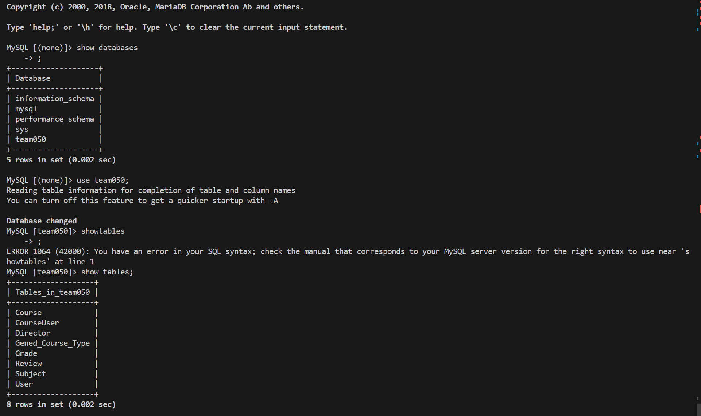

## DDL Commands

```sql
CREATE TABLE Course (
    Course_Code varchar(255) NOT NULL,
    Introduction varchar(255),
    AverageGPA double,
    Subject_Code varchar(255),
    Gened_Type_ID int,
    PRIMARY KEY (Course_Code)
    FOREIGN KEY (Subject_Code) REFERENCES Subject(Code),
    FOREIGN KEY (Gened_Type_ID) REFERENCES Gened_Course_Type(ID)
);

CREATE TABLE CourseUser (
    Course_Code varchar(255) NOT NULL,
    UserId varchar(255) NOT NULL,
    PRIMARY KEY (Course_Code, UserId)
    FOREIGN KEY (Course_Code) REFERENCES Course(Course_Code),
    FOREIGN KEY (UserId) REFERENCES User(UserId)
);

CREATE TABLE Director (
    Name varchar(255) NOT NULL,
    Office varchar(255),
    PhoneNumber varchar(255),
    PRIMARY KEY (Name)
);

CREATE TABLE Gened_Course_Type (
    ID int NOT NULL,
    HUM int DEFAULT NULL,
    SBS int DEFAULT NULL,
    ACP int DEFAULT NULL,
    CS int DEFAULT NULL,
    QR int DEFAULT NULL,
    NAT int DEFAULT NULL,
    PRIMARY KEY (ID)
);

CREATE TABLE Grade (
    YearTerm varchar(255) NOT NULL,
    PrimaryInstructor varchar(255) NOT NULL,
    Course_Code varchar(50) NOT NULL,
    `Number_of_A+` int DEFAULT NULL,
    Number_of_A int DEFAULT NULL,
    `Number_of_A-` int DEFAULT NULL,
    `Number_of_B+` int DEFAULT NULL,
    Number_of_B int DEFAULT NULL,
    `Number_of_B-` int DEFAULT NULL,
    `Number_of_C+` int DEFAULT NULL,
    Number_of_C int DEFAULT NULL,
    `Number_of_C-` int DEFAULT NULL,
    `Number_of_D+` int DEFAULT NULL,
    Number_of_D int DEFAULT NULL,
    `Number_of_D-` int DEFAULT NULL,
    Number_of_F int DEFAULT NULL,
    Number_of_W int DEFAULT NULL,
    PRIMARY KEY (Course_Code, YearTerm, Primary_Instructor),
    FOREIGN KEY (Course_Code) REFERENCES Course(Course_Code)
);

CREATE TABLE Review (
    ReviewID varchar(255) NOT NULL,
    Time varchar(255),
    Content varchar(255),
    Rate int,
    UserId varchar(255),
    Course_Code varchar(255),
    PRIMARY KEY (ReviewID)
    FOREIGN KEY (UserId) REFERENCES User(UserId),
    FOREIGN KEY (Course_Code) REFERENCES Course(Course_Code)
);

CREATE TABLE Subject (
    Code varchar(255) NOT NULL,
    Director varchar(255),
    PRIMARY KEY (Code)
    FOREIGN KEY (Director) REFERENCES Director(Name)
);

CREATE TABLE User (
    UserId varchar(255) NOT NULL,
    Password varchar(255) NOT NULL,
    Gender varchar(10),
    Age int,
    Degree varchar(30),
    PRIMARY KEY (UserId)
);

```
## Table Implementation

For Table `User`, some random users are inserted into the table.

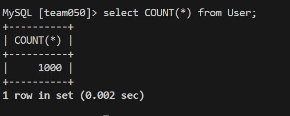

For Table `Course`, we upload all needed csv files to Google Cloud storage bucket, then import these csv files from the bucket to corresponding tables.

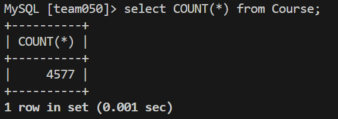

For Table `Director`, we upload all needed csv files to Google Cloud storage bucket, then import these csv files from the bucket to corresponding tables.

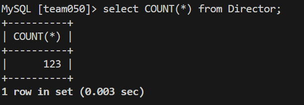

For Table `Gened_Course_Type`, we upload all needed csv files to Google Cloud storage bucket, then import these csv files from the bucket to corresponding tables.

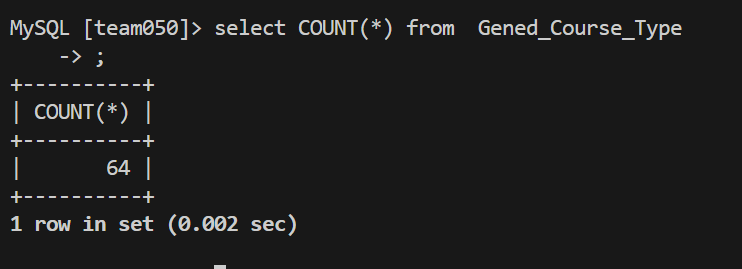

For Table `Grade`, we upload all needed csv files to Google Cloud storage bucket, then import these csv files from the bucket to corresponding tables.

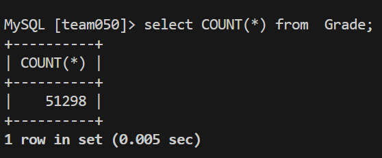

For Table `Subject`, we upload all needed csv files to Google Cloud storage bucket, then import these csv files from the bucket to corresponding tables.

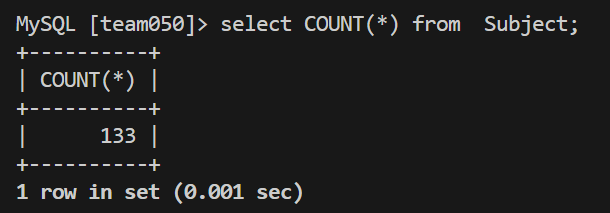

For Table `Review`, some random reviews are inserted into the table.

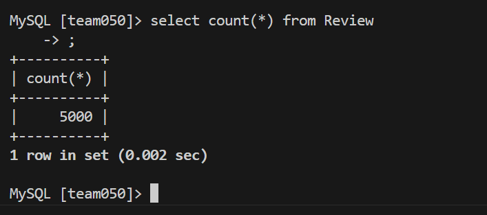

For Table `CourseUser`, some random relationships between courses and users choosing them are inserted into the table.


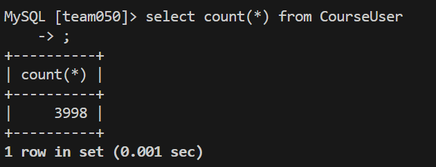

## Advanced Queries
### 1. Finding which geneds to take and which ones to avoid based on GPA and review degree
```sql
SELECT AVG(AverageGPA) as average_gpa, Course_Code 
FROM Gened_Course_Type NATURAL JOIN Course NATURAL JOIN Review NATURAL JOIN User
WHERE AverageGPA >=  3.8 AND CS = 1 AND HUM = 1 AND Degree = "Bachelor"
GROUP BY Course_Code
UNION ALL  
SELECT AVG(AverageGPA) as average_gpa, Course_Code 
FROM Gened_Course_Type NATURAL JOIN Course 
WHERE AverageGPA <=  2.0 AND CS = 1 AND HUM = 1  
GROUP  BY Course_Code;
```
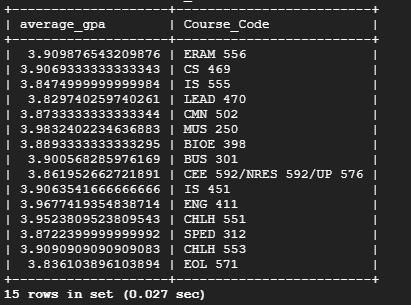

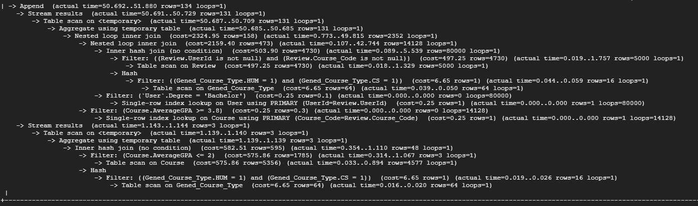

#### Indexing schemes:

1. **Indexing on ``Course(AverageGPA)``**
```
CREATE INDEX idx_average_gpa on Course(AverageGPA);
Query OK, 0 rows affected (0.096 sec)
Records: 0  Duplicates: 0  Warnings: 0
```
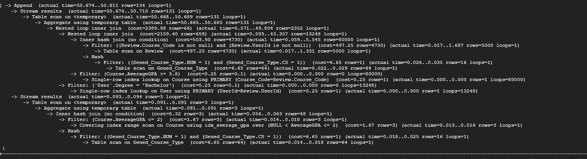

**Result:** Significant decrease in cost when filtering by AverageGPA.

**Analysis:** ``Filter: (Course.AverageGPA <= 2)  (cost=1.67 rows=3)`` from this analysis shows a heavily decreased amount compared to ``cost=575.86`` in the analysis with no indexing scheme. This is because the database can now find AverageGPA values faster and can therefore filter them more efficiently. 


2. **Indexing on ``Review(Degree)``**
```
CREATE INDEX idx_degree ON User(Degree);
Query OK, 0 rows affected (0.071 sec)
Records: 0  Duplicates: 0  Warnings: 0
```
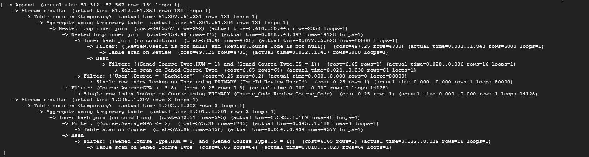

**Result:** There was no significant improvement in the performance of the query.

**Analysis:** No portion of the query was significantly improved, particularly in the ``Degree`` filtering portion of the analysis. This is because ``Degree`` does not have a high enough selectivity to greatly benefit from indexing. 

3. **Indexing on ``Gened_Course_Type(Hum)``**
```
CREATE INDEX idx_hum on Gened_Course_Type(HUM);
Query OK, 0 rows affected (0.032 sec)
Records: 0  Duplicates: 0  Warnings: 0
```
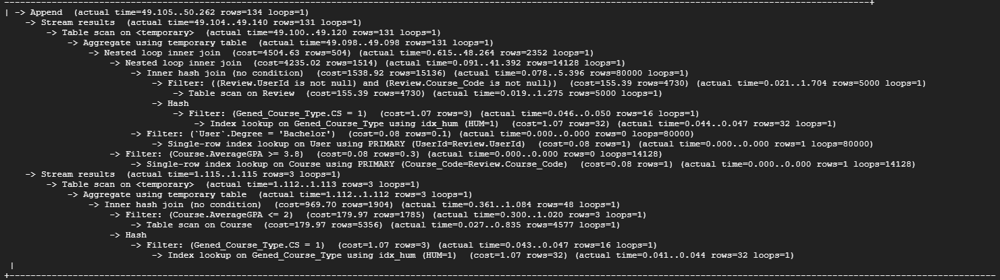

**Result:** The filtering through ``Gened_Course_Type`` was decreased by around a factor of 6. The cost of the inner join was nearly doubled. 

**Analysis:** The significant improvement in the filtering cost seems impressive at first, but the cost is only going from around 6.65 to 1.07. When the inner join cost can jump from 2159.40 to 4235.02. Also, indexing by just one of the many different gened course types will be ineffective when users query for different types. 

#### Justification: 
The only justified indexing scheme for this advanced query is scheme 1. This scheme shows the greatest factor of improvement, bringing an original filtering cost of 575.86 all the way down to 1.67. It is also the most practical because AverageGPA has high selectivity and is a metric that is important to students.  

### 2. Find courses that have up-to-date reviews that are positive:
```sql
SELECT Course_Code, Introduction, AVG(AverageGPA) 
FROM Course NATURAL JOIN Review 
WHERE Rate >= 4 AND Time LIKE "2023%" 
GROUP BY Course_Code, Introduction;
```

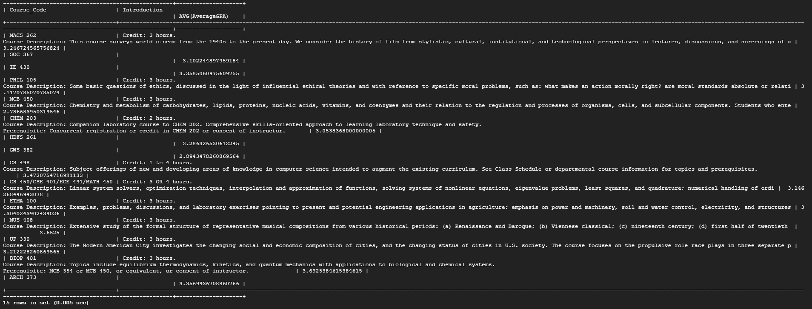

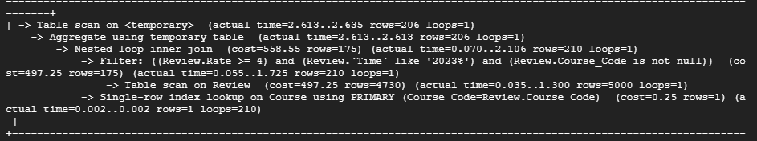

#### Indexing schemes:

1. **Indexing on ``Review(Time)``**

``MySQL [team050]> CREATE INDEX idx_time ON Review(Time);
Query OK, 0 rows affected (0.092 sec)
Records: 0  Duplicates: 0  Warnings: 0``

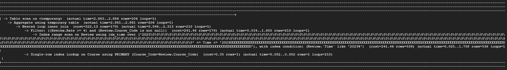

**Result:** The cost of the filtering portion decreased by 50%. 

**Analysis:** Because ``Time`` has a high selectivity and the query, this is an effective table to index over. And because in this scenario we are filtering by this table, this saves the database cost when looking through each entry. 

2. **Indexing on ```Review(Rate)```**

``CREATE INDEX idx_rate ON Review(Rate);``
``Query OK, 0 rows affected, 1 warning (0.110 sec)``
``Records: 0  Duplicates: 0  Warnings: 1``

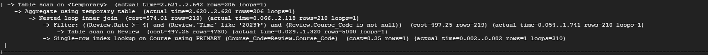

**Result:** There was no significant change in the performance of the query.

**Analysis:** This is because ``Rate`` has very low selectivity. Since ``Rate`` can only be 1 of  5 different values, indexing will not have a significant effect on the query's performance.

3. **Indexing on ```Course(Course_Code, Introduction)```**

``CREATE INDEX idx_course_code_introduction on Course(Course_Code, Introduction);``
``Query OK, 0 rows affected (0.328 sec)``
``Records: 0  Duplicates: 0  Warnings: 0``

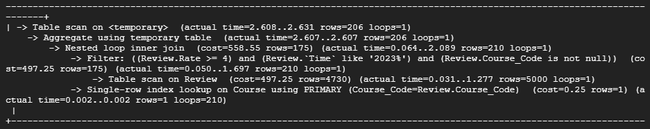

**Result:** There was no significant change in the performance of the query.

**Analysis:** Since the query is grouped by Course_Code and Introduction, creating an index would theoretically save cost. Here, the overhead used for the index did not create a change in the cost.

#### Justification: 
The only justified indexing scheme for this advanced query is scheme 1. This scheme is the only one that provided a significant improvement in the cost of the query. This indexing scheme is also likely to be utilized often since there are many cases where users will want to filter reviews by date. This guarantees that the overhead needed to maintain this scheme will not go to waste. 

### 3.Find courses that are taught by teachers with a rating average of over 3
```sql
SELECT c.Course_Code,  g.PrimaryInstructor, AVG(r.Rate) AS Average_Rating
FROM Course c
JOIN Grade g ON c.Course_Code = g.Course_Code
JOIN Review r ON c.Course_Code = r.Course_Code
GROUP BY c.Course_Code, c.Introduction, g.PrimaryInstructor
HAVING AVG(r.Rate) > 3
LIMIT 15;
```
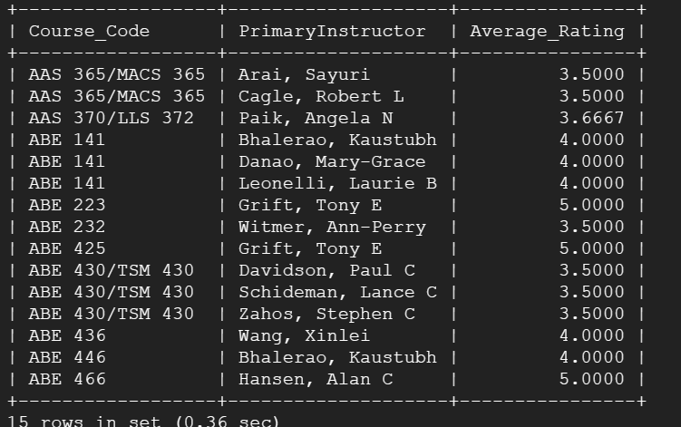 

#### EXPLAIN ANALYZE before adding the indices
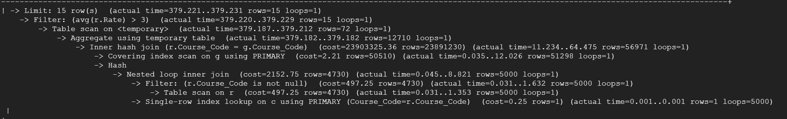

#### Indexing schemes:

1. **Indexing on ``Review(Rate, Course_Code)``**
```
mysql> CREATE INDEX idx_review_rate_course_code ON Review (Rate, Course_Code);
Query OK, 0 rows affected (0.09 sec)
Records: 0  Duplicates: 0  Warnings: 0
```

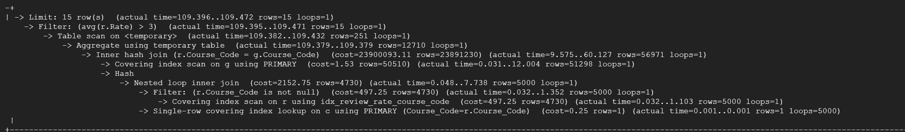
Result: We can see that the total query time has been reduced from 379 ms to 109 ms, which is a significant improvement. `Covering index scan on r using idx_review_rate_course_code` means that the query is able to retrieve the data from the `Review` table using the indexes directly, without the need to go back to the original data page. This makes retrieval much faster.

Analysis: The composite index of `Rate` and `Course_Code` on the `Review` table, `idx_review_rate_course_code`, significantly improves the efficiency of query filtering and join operations. Especially when the Review table is large, a full table scan is a very time-consuming operation. Using the index, the database can quickly locate those records where the Rate field is eligible and then match them with Course_Code, greatly reducing the amount of data that must be examined.

2. **Indexing on ``Grade (Course_Code, PrimaryInstructor)``**

```
mysql> CREATE INDEX idx_grade_course_instructor ON Grade (Course_Code, PrimaryInstructor);
Query OK, 0 rows affected (0.71 sec)
Records: 0  Duplicates: 0  Warnings: 0
```
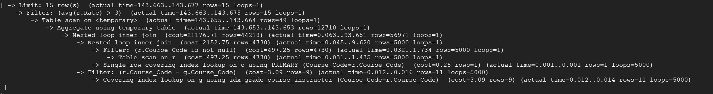
Result: The query time was reduced to 143.677 ms, a significant improvement over the original 379.231 ms. The Nested loop inner join is more efficiently performed on the `Grade` and `Review` tables due to its ability to leverage the `idx_grade_course_instructor` index to quickly locate eligible rows.

Analysis: A `Covering index lookup` on the `Grade` table indicates that the query operation is using data directly from the index, which is usually much faster than scanning the entire table. Meanwhile, the aggregate operations use temporary tables, as with the original query, but take less time overall because the index improves the efficiency of join operations.

3. **Indexing on ``Grade (Course_Code)`` and ``Review (Course_Code)``**

```   
mysql> CREATE INDEX idx_grade_course_code ON Grade (Course_Code);
Query OK, 0 rows affected (0.71 sec)
Records: 0  Duplicates: 0  Warnings: 0

mysql> CREATE INDEX idx_review_course_code ON Review (Course_Code);
Query OK, 0 rows affected (0.06 sec)
Records: 0  Duplicates: 0  Warnings: 0
```
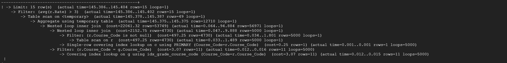

Result: The total query time was 145.404 milliseconds, which is similar to the time with the addition of the `idx_grade_course_instructor` index (about 143 ms).The query uses a `Covering index lookup`, which means that join operations on the `Grade` and `Review` tables can use the indexes directly to get the data they need, which is usually more efficient than a table scan.
`Nested loop inner join` indicates that the query uses nested loops for join operations, which typically performs better with index optimisation.

Analysis: With the indexes applied, the query no longer needs to perform a full table scan on the `Review` table because it can use the indexes to directly locate the relevant rows, which saves time by reducing the number of disk I/O. For the `Grade` table, even without the composite index for `PrimaryInstructor`, the index on `Course_Code` alone is sufficient to optimise the join operation because this field is used in the `JOIN` operation.

#### Final analysis

In the performance analysis of different index designs for a SQL query, significant improvements were observed. The composite index `idx_review_rate_course_code` on the `Review` table (`Rate`, `Course_Code`) led to a substantial reduction in query time from 379ms to 109ms, highlighting its effectiveness in enhancing filtering and join operations. Implementing the composite index `idx_grade_course_instructor` on the `Grade` table (`Course_Code`, `PrimaryInstructor`) also resulted in a notable performance gain, with query time around 143ms, due to optimized join and aggregation processes. Lastly, single-column indexes on both `Grade` and `Review` tables for `Course_Code` achieved moderate performance improvements, reducing the query time to approximately 145ms. These findings underscore the critical role of targeted indexing in optimizing database query efficiency.

### 4. Find users that take difficult courses and count how many they have taken
```sql
select count(*), UserId
from CourseUser natural join Course natural join User
where AverageGPA < 3 and length(User.Password) > 5
group by UserId
order by Age;
```
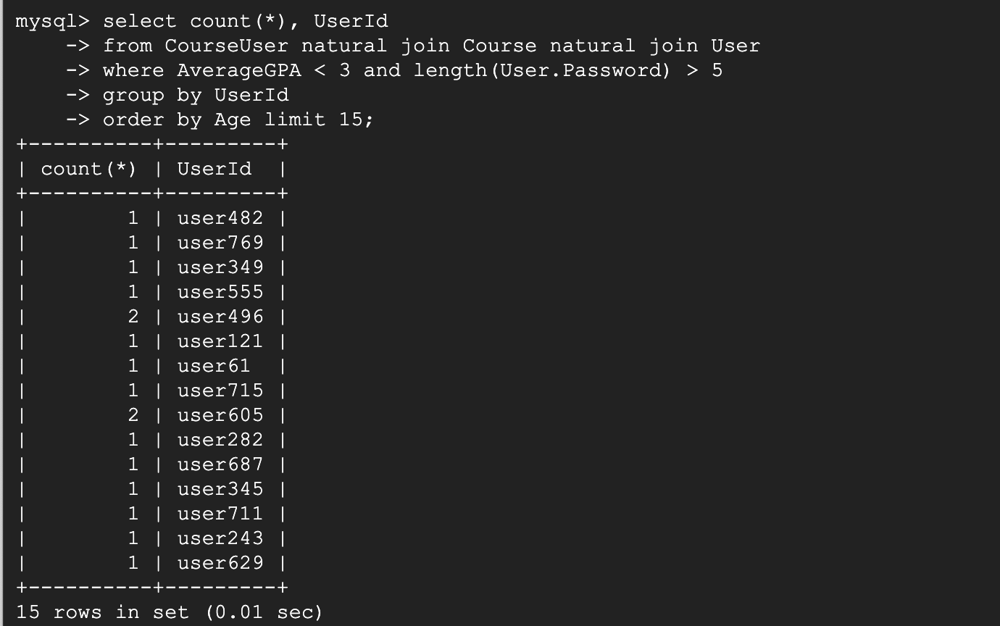

Before adding index:


#### Indexing schemes:
##### **Indexing on ``Course(AverageGPA)``**

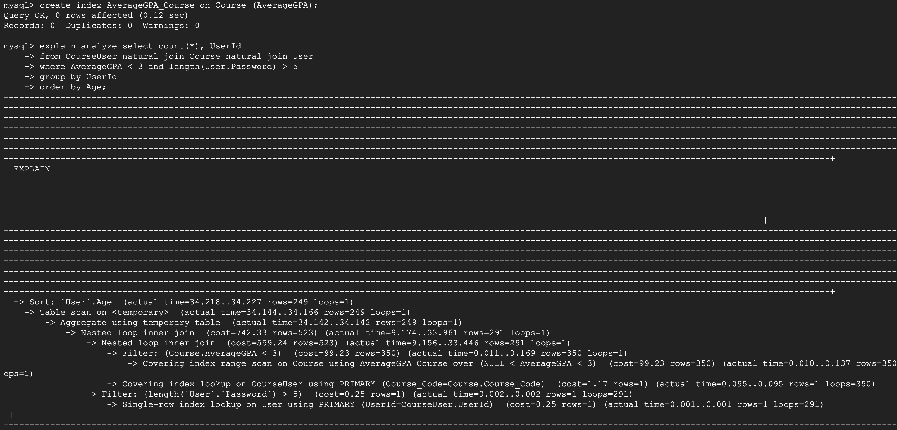

**Analysis**  We used AverageGPA attribute as part of our predicate in the where clause. So it can improve performance.

##### **Indexing on ``Course(AverageGPA)`` and ``User(Password)``**


**Analysis**  We used AverageGPA attribute and Password a as part of our predicate in the where clause. So it can improve performance.

##### **Indexing on ``Course(AverageGPA)`` and ``User(Password)`` and ``User(Age)`` **


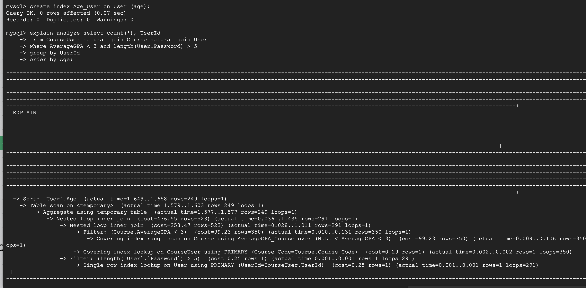

**Analysis**  Not faster than the schema above. We used AverageGPA attribute and Password a as part of our predicate in the where clause. Because because we order the output table using age attribute, it is thus not part of the original relation attribute and cannot utlizie its index.

#### **Final analysis**
Indexing on ``Course(AverageGPA)`` and ``User(Password)`` has the best performance according to cost analysis.
