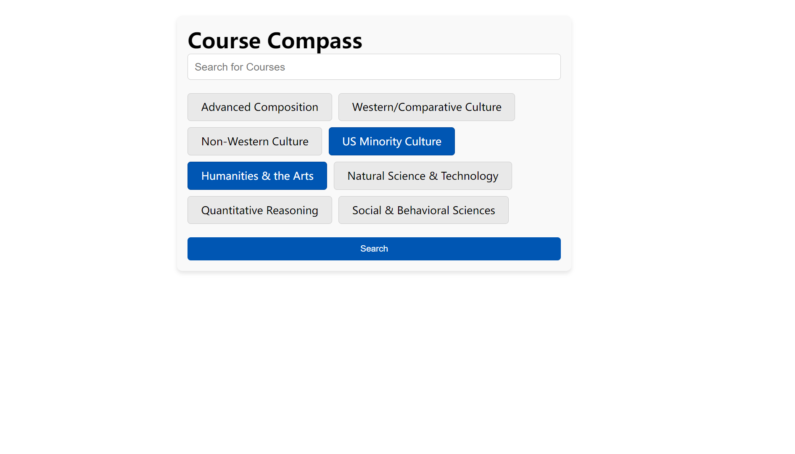
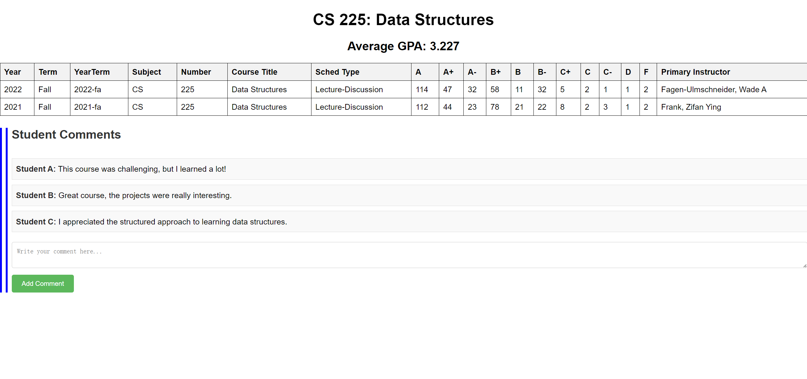

# Course Compasss

## Project Summary: 
Course Compass is an innovative web application designed to assist students in making informed decisions about their course selections. By providing historical GPA data for each course across different years, it enables students to understand the academic rigor and grading trends. The platform aims to demystify course selection, making it easier for students to choose courses that align with their academic goals and expectations.

## Application Description:
The primary goal of Course Compass is to solve the challenge students face in selecting courses that best fit their academic trajectory. Often, students lack access to historical grading data, which can lead to uninformed choices. This application will aggregate and present historical GPA data of courses, allowing students to assess the difficulty level and grading patterns of different classes over the years.

## Usefulness:
Our web application will provide users with the historical GPA data for individual courses across various semesters basesd on the GPA dataset we already have (from spring 2010 - spring 2023). Additionally, our platform will also  present the average GPA for courses taught by the same professor and link the instructor name to the outside professor evaluation website like [Ratemyprofessors](https://www.ratemyprofessors.com/search/professors/1112?q=*). which could offer students a clearer understanding of teaching styles and grading patterns of individual instructors. There are already some excellent GPA information platform like "GPA++" and "GPA visualizations by waf.cs". Unlike other course evaluation websites that generally provide only a cumulative GPA for courses, Course Compass will offer a detailed, semester-wise breakdown of GPA data and some information about the instructor's evalution. This granular level of data enables students to make more informed decisions by observing how a course's difficulty and grading standards may have evolved over time and under different instructors. Moreover, to enhance the interactivity and richness of information on our website, we plan to introduce a user comment feature. Students who have taken a course can leave their feedback at the bottom of the course page. These comments may include their own grades, overall class experience, and opinions about the professor's teaching methods. This feature will not only provide firsthand course experiences for other students but also offer a multi-dimensional perspective when selecting courses. These comments will be displayed at the lower section of each course page, making it easy for users to browse and refer to.

## Creative Component
This project envisions the creation of a novel course grade inquiry website that not only provides historical grade distributions for various courses but also incorporates a personalized course recommendation feature. The core idea is to allow users to input the courses they have previously taken, forming a user-course matrix. Once this matrix is established, it paves the way for implementing a Collaborative Filtering approach to recommend courses.This project envisions the creation of a novel course grade inquiry website that not only provides historical grade distributions for various courses but also incorporates a personalized course recommendation feature. The core idea is to allow users to input the courses they have previously taken, forming a user-course matrix. Once this matrix is established, it paves the way for implementing a Collaborative Filtering approach to recommend courses.However, it's important to note that the effectiveness of this system is contingent on the volume of user-course data. With limited data, the recommendation accuracy might be compromised.

## Realness:
Our data comes from [wadefagen's Useful Datasets](https://github.com/wadefagen/datasets) which is a collection of data related to UIUC. We will mainly use these 3 datasets and they are both in CSV form:
- [GPAs of Courses at The University of Illinois](https://github.com/wadefagen/datasets/tree/main/gpa), `gpa/uiuc-gpa-dataset.csv`
- [Teachers Ranked as Excellent by their Students at UIUC](https://github.com/wadefagen/datasets/tree/main/teachers-ranked-as-excellent), `teachers-ranked-as-excellent/uiuc-tre-dataset.csv`
- [UIUC Courses by their General Education category](https://github.com/wadefagen/datasets/tree/main/geneds), `geneds/uiuc-geneds-dataset.csv`

The gpa dataset looks like :

| Year | Term | YearTerm | Subject | Number | Course Title | Sched Type | A+ | A | A- | B+ | B | B- | C+ | C | C- | D+ | D | D- | F | W | Primary Instructor |
| ---- | ---- | -------- | ------- | ------ | ------------ | ---------- | -- | - | -- | -- | - | -- | -- | - | -- | -- | - | -- | - | - | ------------------ |
| 2023 | Spring | 2023-sp | AAS | 100 | Intro Asian American Studies | DIS | 0 | 11 | 5 | 1 | 4 | 0 | 0 | 0 | 0 | 0 | 0 | 0 | 1 | 0 | Shin, Jeongsu |
| ...  |
| 2017 | Fall | 2017-fa | CS | 225 | Data Structures |  | 114 | 47 | 27 | 6 | 28 | 17 | 14 | 18 | 13 | 12 | 9 | 12 | 16 | 2 | Fagen-Ulmschnei, Wade A |
| 2017 | Fall | 2017-fa | CS | 225 | Data Structures |  | 121 | 40 | 27 | 20 | 29 | 16 | 14 | 24 | 4 | 12 | 14 | 16 | 14 | 4 | Fagen-Ulmschnei, Wade A |
| ...  |

and the teachers dataset looks like :
| term | unit | lname | fname | role | ranking | course |
| ---- | ---- | ----- | ----- | ---- | ------- | ------ |
| fa2003 | ACCOUNTANCY | BALLOU | B | Instructor | Excellent | 304 |
| fa2003 | ACCOUNTANCY | CHANDLER | J | Instructor | Excellent | 304 |
| fa2003 | ACCOUNTANCY | DEREUS | M | TA | Excellent | 201 |
| ... |
| fa2018 | COMPUTER SCIENCE | FAGEN-ULMSCHNEIDER | W | Instructor | Outstanding | 225 |
| ... |

and the Gened course dataset looks like :
| Year | Term | YearTerm | Course | Course Title | ACP | CS | HUM | NAT | QR | SBS |
| ---- | ---- | -------- | ------ | ------------ | --- | -- | --- | --- | -- | --- |
| 2023 | Spring | 2023-sp | AAS 100 | Intro Asian American Studies |  | US | | | | SS |
| ... |
| 2023 | Spring | 2023-sp | CS 107 | Data Science Discovery | | | | | QR1 | |
| ... |

There datasets could provide us with the grade letter proportions of every course over each semester, the teacher's evaluation from students and the attribute of each Gened course.

## Functionality:
1. Enhanced Data Interaction (CRUD Functionality):

- Create: Users will have the ability to contribute to the platform by adding their own course feedback and grades. This will enrich the existing database and provide a more comprehensive view of each course.
- Read: The application will offer detailed access to historical GPA data, professor evaluations, and user-submitted comments. Users can read and analyze semester-wise GPA distributions, instructor-specific grading trends, and real student experiences.
- Update: Users will be able to update their previously submitted comments or course grades, ensuring that the information stays current and relevant. This feature allows for the evolution of course feedback over time.
- Delete: Users can remove their comments or personal data, adhering to privacy and data management standards. This ensures user control over their shared information on the platform.
  
2. Advanced Query Capabilities:

- Filtering and Sorting: Users can filter courses based on several criteria such as General Education categories, instructor names, difficulty levels, and historical GPA trends. Additionally, sorting options will enable users to arrange courses based on GPA averages, popularity, and user ratings.
- Personalized Course Recommendations: Utilizing Collaborative Filtering, the system will suggest courses to users based on their academic history and preferences. This feature will employ advanced queries to analyze the user-course matrix and generate tailored recommendations.
- Comparative Analysis: Users can perform side-by-side comparisons of courses or instructors based on GPA data and user comments. This will assist in making informed decisions between similar courses or instructors with different teaching styles.
Search interface

   
  
Course information page and Comments region

 

